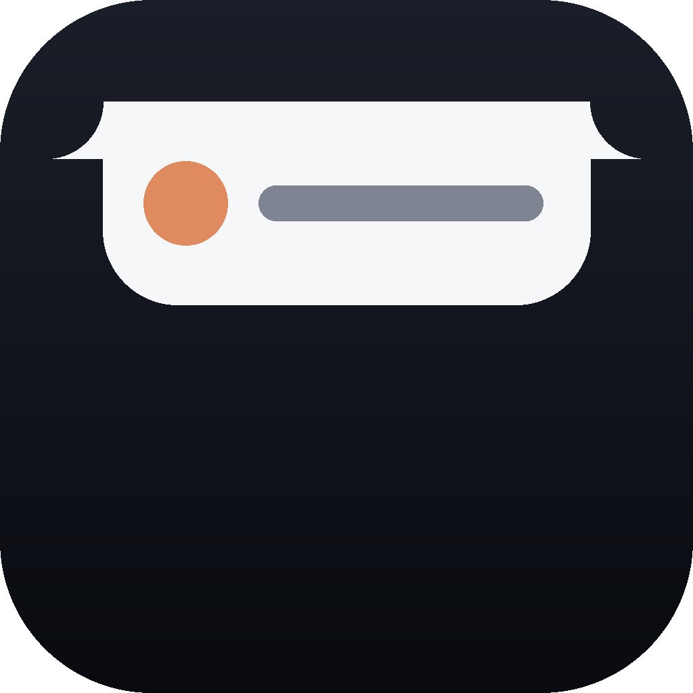
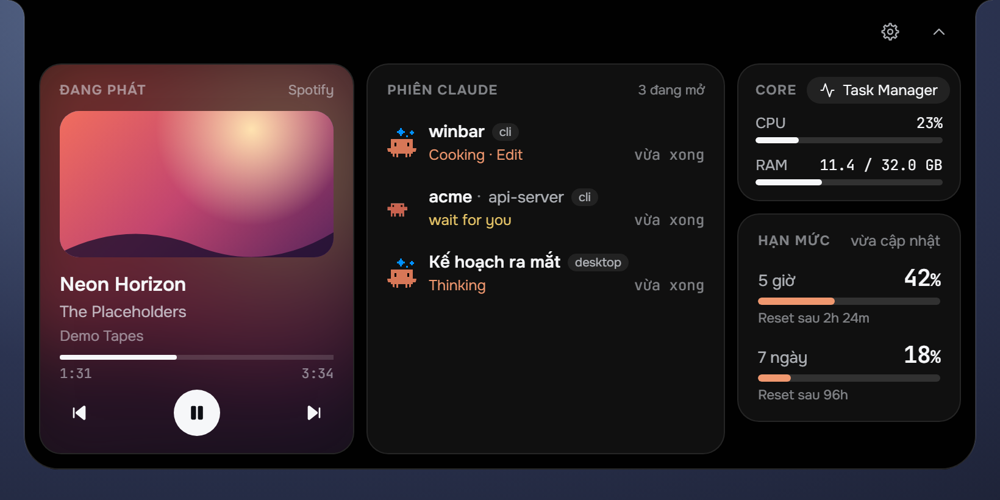
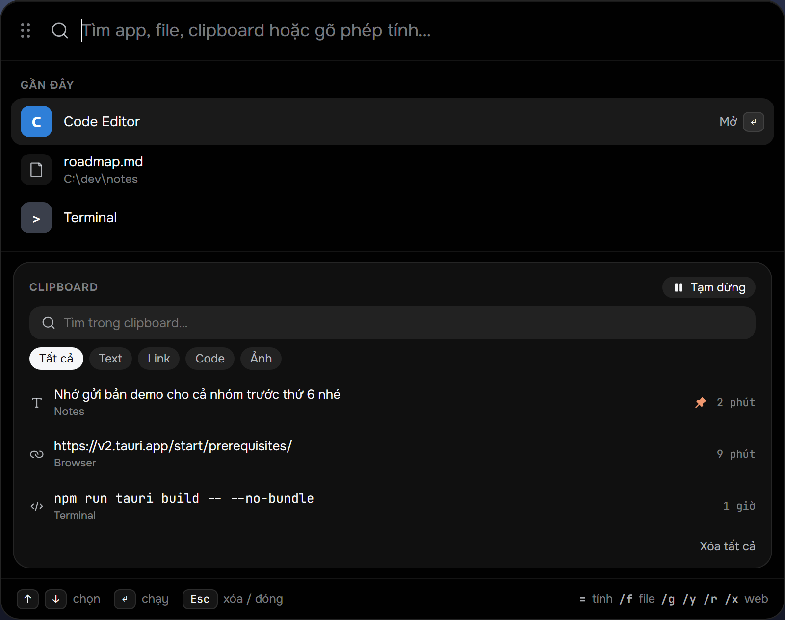

<p align="center">
  
</p>

<h1 align="center">winbar</h1>

<p align="center">
  Một “notch” kiểu Dynamic Island cho Windows 11 — nằm ở mép trên màn hình, cho biết Claude Code đang làm gì,
  bài nhạc nào đang phát, máy đang bận ra sao, và mở ra một command bar bằng <kbd>Ctrl</kbd>+<kbd>Space</kbd>.
</p>

<p align="center">
  
</p>

---

## Tính năng

### Notch & pill

- **Pill thu gọn ở mép trên màn hình**, luôn nằm trên cùng nhưng không chiếm chỗ trên taskbar.
- **Pill tự đổi theo việc đang diễn ra**: Claude đang chạy, Claude chờ bạn duyệt quyền, hay nhạc đang phát.
- **Pill đôi**: vừa có Claude chạy vừa có nhạc thì notch dài ra để hiện cả hai cùng lúc.
- **Bấm vào notch để mở panel dạng bento** — các widget xếp thành lưới, widget quan trọng chiếm ô lớn.
- **Hai chất liệu**: `liquid` (gradient mờ) và `dense` (đen đặc `#010101`), kèm thanh chỉnh **độ trong suốt**
  từ 0–100% (100% là đen hoàn toàn).
- Ẩn/hiện notch bất cứ lúc nào từ command bar.

### Widget trong panel

| Widget | Hiển thị |
| --- | --- |
| **Claude · phiên** | Các phiên Claude Code đang chạy (terminal và Claude Desktop), trạng thái đang làm / chờ duyệt / xong. Bấm một phiên để mở terminal ở đúng thư mục dự án, hoặc đưa Claude Desktop lên trước. |
| **Claude · usage** | Mức dùng hạn mức hiện tại của tài khoản Claude. |
| **Media** | Ảnh bìa lớn ở hàng trên, tên bài, nút phát/dừng/chuyển bài và thanh tiến trình ở hàng dưới — lấy từ bất kỳ app nào phát nhạc qua Windows media controls. |
| **Core** | CPU và RAM theo thời gian thực, kèm nút mở Task Manager. |

Mỗi widget bật/tắt và sắp thứ tự được trong Cài đặt.

> **Widget phiên Claude cần một hook của Claude Code.** winbar chỉ đọc file trạng thái do hook ghi ra, không tự
> cài hook. Chưa có hook thì pill Claude không bao giờ hiện, dù widget đang bật. Xem
> [hướng dẫn tạo hook](docs/claude-status-hook.md): có sẵn prompt để Claude Code trên máy bạn tự làm.

### Command bar (<kbd>Ctrl</kbd>+<kbd>Space</kbd>)

<p align="center">
  
</p>

Một ô tìm kiếm nổi giữa màn hình, gõ là ra:

- **Ứng dụng** đã cài và **lịch sử** những gì bạn hay mở.
- **Máy tính** (`12*(3+4)`) và **đổi đơn vị** (`5 km to mi`, `100 f sang c`).
- **Tìm file** với tiền tố `/f`.
- **Tìm web**: `?` cho công cụ mặc định, hoặc `/g` Google, `/y` YouTube, `/r` Reddit, `/x` X.
- **Phiên Claude** với tiền tố `cl` — chọn để mở lại terminal ở thư mục của phiên đó.
- **Clipboard** với tiền tố `cb`.
- **Hành động của winbar**: mở notch, ẩn/hiện notch, cài đặt, thoát.

Khi ô tìm kiếm còn trống, command bar hiện luôn khối **lịch sử clipboard**.

### Lịch sử clipboard

- Lưu text và ảnh đã copy; bấm một mục để copy lại.
- Tìm kiếm, lọc theo loại, **ghim** mục quan trọng, **tạm dừng** ghi lại.
- Mục không ghim tự xoá sau 1 hoặc 2 ngày (tuỳ chọn).
- **Tự bỏ qua những thứ trông như bí mật** (API key, token, JWT…) và bỏ qua các app bạn liệt kê.
- Kéo thả ảnh từ lịch sử thẳng vào app khác.

### Tiện ích hệ thống

- **Khởi động cùng Windows** (bật/tắt trong Cài đặt, chỉ ở bản release).
- **Chỉ chạy một bản**: mở winbar lần nữa sẽ hiện lại notch và mở Cài đặt thay vì chạy bản thứ hai.
- **Đổi phím tắt** command bar trong Cài đặt.
- Nhẹ: khi Claude rảnh, trình theo dõi chỉ quét lại mỗi vài giây và chỉ báo lên giao diện khi có gì thực sự đổi.

## Bảo mật & quyền riêng tư

- Mọi thứ chạy **cục bộ**; winbar không gửi dữ liệu của bạn đi đâu.
- winbar chỉ **đọc** thư mục cấu hình của Claude Code (tôn trọng `CLAUDE_CONFIG_DIR`), không ghi vào đó.
- Mở terminal cho một phiên Claude chỉ nhận thư mục cục bộ có thật; đường dẫn mạng (UNC) bị từ chối, và đường dẫn
  có ký tự lạ sẽ mở bằng PowerShell thay vì Windows Terminal để không bị chèn lệnh.
- Lịch sử clipboard nằm trên máy bạn, bỏ qua nội dung giống bí mật, và có thể tạm dừng bất cứ lúc nào.

## Cài đặt & chạy

Yêu cầu: Windows 11, [Node.js](https://nodejs.org) 20+, [Rust](https://rustup.rs) stable và
[các điều kiện của Tauri 2](https://v2.tauri.app/start/prerequisites/) (WebView2, MSVC build tools).
Muốn thấy phiên Claude trên notch thì cần thêm [hook trạng thái Claude Code](docs/claude-status-hook.md).

```powershell
npm install
npm run tauri dev                    # chạy bản phát triển
npm run tauri build -- --no-bundle   # build bản release: src-tauri\target\release\winbar.exe
```

> Build bằng `npm run tauri build`, đừng dùng `cargo build --release` trực tiếp — cách sau không nhúng giao diện vào exe.

**Cập nhật lên bản mới:** thoát winbar trước (icon khay → *Thoát winbar*), rồi `git pull`, `npm install` và build lại
như trên, xong mở lại `winbar.exe`. Nếu winbar còn chạy, build sẽ dừng ở lỗi `failed to remove file ... winbar.exe`
/ `Access is denied`, vì Windows khoá file exe đang chạy.

### Ghim lên taskbar

Cửa sổ của winbar không có nút trên taskbar, nên hãy tạo một shortcut rồi ghim nó:

```powershell
.\scripts\pin-winbar.ps1            # thêm vào Start Menu (chuột phải → Pin to taskbar)
.\scripts\pin-winbar.ps1 -Desktop   # thêm cả shortcut ngoài Desktop
.\scripts\pin-winbar.ps1 -Remove    # gỡ shortcut
```

## Kiểm thử

```powershell
npm test                              # test giao diện (Vitest)
npm run lint                          # ESLint + kiểm tra kiểu TypeScript
cargo test --manifest-path src-tauri/Cargo.toml
```

## Công nghệ

[Tauri 2](https://v2.tauri.app) (Rust) · React 19 · TypeScript · Vite · Vitest

## Tài liệu

Mỗi phần có một đặc tả riêng ở gốc repo: [notch](SPEC-notch-shell.md), [Claude](SPEC-claude.md),
[media](SPEC-media.md), [Core](SPEC-system.md), [command bar](SPEC-command-bar.md), [clipboard](SPEC-clipboard.md);
bức tranh tổng thể ở [`CAPABILITY-MAP.md`](CAPABILITY-MAP.md), mockup giao diện trong [`design/`](design/).
Có gì mới thì xem [`CHANGELOG.md`](CHANGELOG.md).

## Giấy phép

[MIT](LICENSE).
