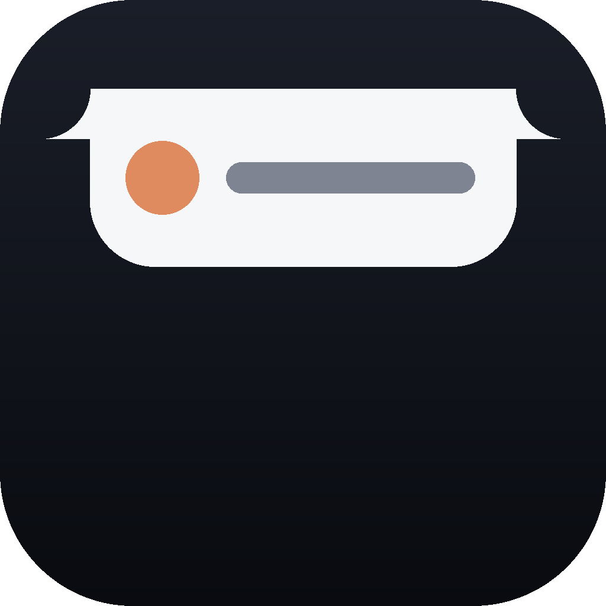
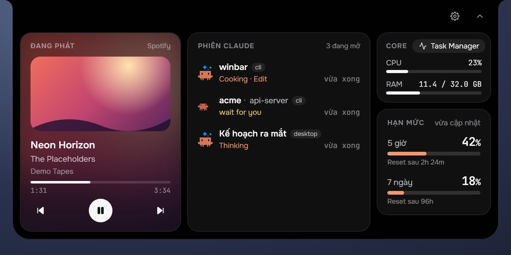
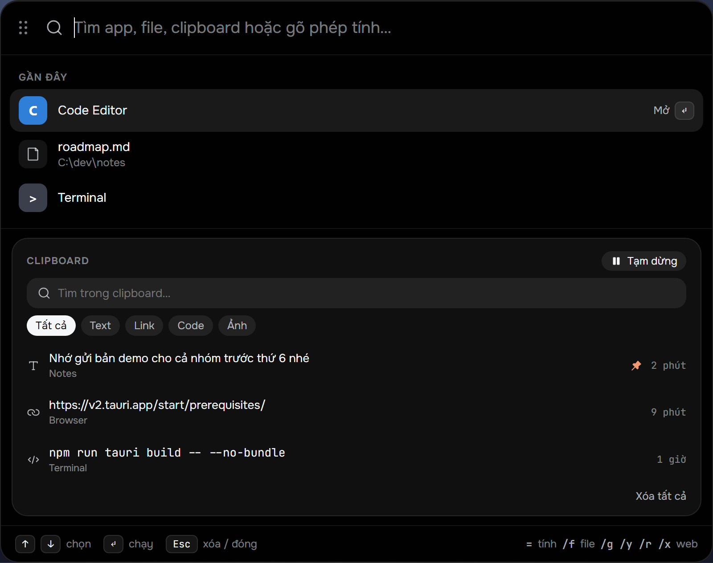

<p align="center">
  
</p>

<h1 align="center">winbar</h1>

<p align="center">
  Một “notch” kiểu Dynamic Island cho Windows 11 — nằm ở mép trên màn hình, cho biết Claude Code đang làm gì,
  bài nhạc nào đang phát, máy đang bận ra sao, và mở ra một command bar bằng <kbd>Ctrl</kbd>+<kbd>Space</kbd>.
</p>

> **Cập nhật mới nhất — bản 0.4.0, ngày 02/10/2026**
>
> - **Thả file vào notch để hỏi Claude.** Kéo một file PDF, ảnh, CSV/Excel hay Word từ Explorer thả lên pill: một
>   cửa sổ terminal mở ra với Claude Code đã biết file đó và chờ bạn gõ câu hỏi. Phiên này luôn hỏi quyền trước khi
>   làm gì, và không nạp cấu hình Claude Code nằm trong thư mục chứa file.
> - **Báo khi phiên Claude dừng.** Lượt chạy từ 30 giây trở lên kết thúc thì pill báo `✓ <dự án> · xong` kèm một dòng
>   từ câu trả lời cuối; dừng vì lỗi hay chạm giới hạn dùng thì luôn báo.
> - **Số agent con.** Phiên đang chạy agent con hiện `+N agent` trên card Phiên Claude và `+N` trên pill.
> - **Đang dùng 0.3.0 và đã bật duyệt quyền?** Sau khi cập nhật, vào Cài đặt › Claude và bấm *Cài lại…*, rồi mở lại
>   phiên Claude Code: thông báo phiên dừng và số agent con cần ba sự kiện hook mới.
>
> Đầy đủ và các bản trước: [`CHANGELOG.md`](CHANGELOG.md).

<p align="center">
  
</p>

---

## Tính năng

### Notch & pill

- **Pill thu gọn ở mép trên màn hình**, luôn nằm trên cùng nhưng không chiếm chỗ trên taskbar.
- **Pill tự đổi theo việc đang diễn ra**: Claude đang chạy, Claude chờ bạn duyệt quyền, hay nhạc đang phát.
- **Pill đôi**: vừa có Claude chạy vừa có nhạc thì notch dài ra để hiện cả hai cùng lúc.
- **Duyệt quyền ngay trên pill** (tuỳ chọn, tắt sẵn): khi Claude Code xin quyền chạy một tool, pill hiện tên
  project và câu lệnh, kèm nút *Từ chối* và *Cho phép*. Lệnh nào pill không hiện đủ thì nút là *Xem…*, mở thẻ đọc hết
  tham số rồi mới duyệt. Terminal vẫn hỏi song song, trả lời ở đâu trước thì tính ở đó. Bật ở Cài đặt › Claude ›
  *Duyệt quyền trên notch*. Pill chỉ hiện khi Claude Code thật sự hỏi quyền: ở chế độ quyền `auto` hay
  `bypassPermissions` nó tự duyệt phần lớn lệnh nên hầu như không có gì để hiện.
- **Thả file vào notch để hỏi Claude**: kéo một file PDF, ảnh, CSV/Excel hay Word từ Explorer thả lên pill, một
  cửa sổ terminal mở ra với Claude Code đã biết file đó và chờ bạn gõ câu hỏi. Phiên này luôn chạy ở chế độ hỏi
  quyền và đứng trong một thư mục riêng của winbar, không phải thư mục chứa file. Loại file khác, thư mục và
  đường dẫn mạng bị từ chối ngay lúc kéo vào. Cần widget Phiên Claude đang bật.
- **Báo khi phiên Claude dừng** (cần hook duyệt quyền): lượt chạy từ 30 giây trở lên kết thúc thì pill báo
  `✓ <dự án> · xong` kèm một dòng từ câu trả lời cuối; phiên dừng vì lỗi hay chạm giới hạn dùng thì luôn báo. Tắt
  được ở Cài đặt › Claude › *Báo khi phiên dừng*.
- **Bấm vào notch để mở panel dạng bento** — các widget xếp thành lưới, widget quan trọng chiếm ô lớn.
- **Hai chất liệu**: `liquid` (gradient mờ) và `dense` (đen đặc `#010101`), kèm thanh chỉnh **độ trong suốt**
  từ 0–100% (100% là đen hoàn toàn).
- Ẩn/hiện notch bất cứ lúc nào từ command bar.

### Widget trong panel

| Widget | Hiển thị |
| --- | --- |
| **Claude · phiên** | Các phiên Claude Code đang chạy (terminal và Claude Desktop), trạng thái đang làm / chờ duyệt / xong. Bấm một phiên để mở terminal ở đúng thư mục dự án, hoặc đưa Claude Desktop lên trước. Đã bật duyệt quyền thì phiên đang chạy hiện thêm ba bước gần nhất (đọc file nào, chạy lệnh gì). |
| **Claude · usage** | Mức dùng hạn mức hiện tại của tài khoản Claude. |
| **Media** | Ảnh bìa lớn ở hàng trên, tên bài, nút phát/dừng/chuyển bài và thanh tiến trình ở hàng dưới — lấy từ bất kỳ app nào phát nhạc qua Windows media controls. |
| **Core** | CPU và RAM theo thời gian thực, kèm nút mở Task Manager. |

Mỗi widget bật/tắt và sắp thứ tự được trong Cài đặt.

> **Có hai bộ hook của Claude Code, độc lập với nhau.**
>
> | Hook | Để làm gì | Ai cài |
> | --- | --- | --- |
> | **Trạng thái** | Widget phiên Claude và pill Claude biết phiên nào đang chạy, đang làm gì | Bạn tự cài: winbar chỉ đọc file hook này ghi ra. Xem [hướng dẫn tạo hook](docs/claude-status-hook.md), có sẵn prompt để Claude Code trên máy bạn tự làm |
> | **Duyệt quyền** | Nút *Từ chối* / *Cho phép* trên pill, ba bước gần nhất của phiên, báo khi phiên dừng, và số agent con đang chạy | winbar cài khi bạn bấm ở Cài đặt › Claude › *Duyệt quyền trên notch*, sau màn xem trước; gỡ cũng ở đó |
>
> Chưa có hook trạng thái thì pill Claude không bao giờ hiện, dù widget đang bật. Chưa cài hook duyệt quyền thì mọi
> thứ khác vẫn chạy, chỉ là bạn trả lời yêu cầu cấp quyền trong terminal như cũ. Hook duyệt quyền cần Git Bash (Claude
> Code trên Windows dùng nó để chạy hook), và phiên Claude Code đang mở phải mở lại mới dùng hook vừa cài. Đã cài
> hook từ bản 0.3.0 thì sau khi lên 0.4.0, Cài đặt › Claude sẽ báo hook chưa đủ: bấm *Cài lại…* để có thông báo phiên
> dừng và số agent con.
>
> **Phiên chạy trên cloud không hiện.** winbar chỉ thấy phiên Claude Code chạy trên máy này. Phiên cloud (Claude
> Desktop với môi trường cloud, claude.ai/code, `claude --cloud`) chạy hook trên máy chủ của Anthropic nên không
> để lại gì trên máy để winbar đọc.

### Command bar (<kbd>Ctrl</kbd>+<kbd>Space</kbd>)

<p align="center">
  
</p>

Một ô tìm kiếm nổi giữa màn hình, gõ là ra:

- **Ứng dụng** đã cài và **lịch sử** những gì bạn hay mở.
- **Máy tính** (`12*(3+4)`) và **đổi đơn vị** (`5 km to mi`, `100 f sang c`).
- **Tìm file** với tiền tố `/f`.
- **Tìm web**: `?` cho công cụ mặc định, hoặc `/g` Google, `/y` YouTube, `/r` Reddit, `/x` X.
- **Phiên Claude** với tiền tố `cl` — chọn để mở lại terminal ở thư mục của phiên đó.
- **Clipboard** với tiền tố `cb`.
- **Hành động của winbar**: mở notch, ẩn/hiện notch, cài đặt, thoát.

Khi ô tìm kiếm còn trống, command bar hiện luôn khối **lịch sử clipboard**.

### Lịch sử clipboard

- Lưu text và ảnh đã copy; bấm một mục để copy lại.
- Tìm kiếm, lọc theo loại, **ghim** mục quan trọng, **tạm dừng** ghi lại.
- Mục không ghim tự xoá sau 1 hoặc 2 ngày (tuỳ chọn).
- **Tự bỏ qua những thứ trông như bí mật** (API key, token, JWT…) và bỏ qua các app bạn liệt kê.
- Kéo thả ảnh từ lịch sử thẳng vào app khác.

### Tiện ích hệ thống

- **Khởi động cùng Windows** (bật/tắt trong Cài đặt, chỉ ở bản release).
- **Chỉ chạy một bản**: mở winbar lần nữa sẽ hiện lại notch và mở Cài đặt thay vì chạy bản thứ hai.
- **Đổi phím tắt** command bar trong Cài đặt.
- Nhẹ: khi Claude rảnh, trình theo dõi chỉ quét lại mỗi vài giây và chỉ báo lên giao diện khi có gì thực sự đổi.

## Bảo mật & quyền riêng tư

- Mọi thứ chạy **cục bộ**; winbar không gửi dữ liệu của bạn đi đâu.
- winbar chỉ **đọc** thư mục cấu hình của Claude Code (tôn trọng `CLAUDE_CONFIG_DIR`), không ghi vào đó — trừ
  một trường hợp do bạn chủ động bấm: cài hoặc gỡ hook *Duyệt quyền trên notch*. Khi đó winbar cho xem đúng phần sẽ
  đổi trong `settings.json`, sao lưu file cũ, và chỉ thêm/bớt các mục của chính nó.
- **Duyệt quyền trên notch:** câu lệnh và đường dẫn của một yêu cầu chỉ nằm trong bộ nhớ khi yêu cầu còn mở, không
  ghi ra đĩa hay log. Hook nói chuyện với winbar qua một named pipe chỉ tài khoản Windows của bạn mở được, không qua
  mạng. Ký tự ẩn và ký tự đổi chiều chữ trong câu lệnh được hiện ra thành mã thay vì vẽ nguyên dạng, và winbar không
  mời duyệt thứ nó chưa hiện đủ. Đã chặn gì và chưa chặn được gì: [SPEC-claude-approvals.md](SPEC-claude-approvals.md) §10.
- **Thả file vào notch:** winbar không đọc nội dung file, chỉ đưa đường dẫn cho Claude Code. Tên file không bao giờ
  nằm trên dòng lệnh của shell, phiên luôn mở ở chế độ hỏi quyền, và cấu hình Claude Code nằm trong thư mục chứa file
  (hook, MCP, `CLAUDE.md`) không được nạp. Không chặn được: chữ viết sẵn trong file để dụ Claude — lớp chắn là bạn
  bấm Cho phép hay không. Chi tiết: [SPEC-claude-drop.md](SPEC-claude-drop.md) §8.
- **Báo khi phiên dừng:** dòng trích từ câu trả lời của Claude chỉ nằm trong bộ nhớ và hiện trên pill vài giây;
  không ghi ra đĩa. Chi tiết: [SPEC-claude-notices.md](SPEC-claude-notices.md) §6.
- **Kiểm tra bản mới:** tối đa một tuần một lần, winbar đọc số phiên bản trong `src-tauri/tauri.conf.json` trên
  GitHub. Không gửi gì đi ngoài chính request đó, nhưng GitHub thấy địa chỉ IP của máy bạn. Tắt ở Cài đặt › Chung ›
  *Tự kiểm tra bản mới*.
- Mở terminal cho một phiên Claude chỉ nhận thư mục cục bộ có thật; đường dẫn mạng (UNC) bị từ chối, và đường dẫn
  có ký tự lạ sẽ mở bằng PowerShell thay vì Windows Terminal để không bị chèn lệnh.
- Lịch sử clipboard nằm trên máy bạn, bỏ qua nội dung giống bí mật, và có thể tạm dừng bất cứ lúc nào.

## Cài đặt & chạy

Yêu cầu: Windows 11, [Node.js](https://nodejs.org) 20+, [Rust](https://rustup.rs) stable và
[các điều kiện của Tauri 2](https://v2.tauri.app/start/prerequisites/) (WebView2, MSVC build tools).
Muốn thấy phiên Claude trên notch thì cần thêm [hook trạng thái Claude Code](docs/claude-status-hook.md). Muốn duyệt
quyền trên pill thì sau khi chạy winbar, vào Cài đặt › Claude › *Duyệt quyền trên notch* và bấm *Cài hook…*; build lại
ở thư mục khác thì bấm *Cài lại…* ở đó, vì hook trỏ thẳng vào file `winbar.exe`.

```powershell
npm install
npm run tauri dev                    # chạy bản phát triển
npm run tauri build -- --no-bundle   # build bản release: src-tauri\target\release\winbar.exe
```

> Build bằng `npm run tauri build`, đừng dùng `cargo build --release` trực tiếp — cách sau không nhúng giao diện vào exe.

Có bản mới thì pill báo **"↑ Có bản winbar …"** (tối đa một tuần sau khi phát hành; muốn biết ngay thì bấm
*Kiểm tra ngay* trong Cài đặt › Chung).

**Cập nhật lên bản mới:** thoát winbar trước (icon khay → *Thoát winbar*), rồi `git pull`, `npm install` và build lại
như trên, xong mở lại `winbar.exe`. Nếu winbar còn chạy, build sẽ dừng ở lỗi `failed to remove file ... winbar.exe`
/ `Access is denied`, vì Windows khoá file exe đang chạy.

### Ghim lên taskbar

Cửa sổ của winbar không có nút trên taskbar, nên hãy tạo một shortcut rồi ghim nó:

```powershell
.\scripts\pin-winbar.ps1            # thêm vào Start Menu (chuột phải → Pin to taskbar)
.\scripts\pin-winbar.ps1 -Desktop   # thêm cả shortcut ngoài Desktop
.\scripts\pin-winbar.ps1 -Remove    # gỡ shortcut
```

## Kiểm thử

```powershell
npm test                              # test giao diện (Vitest)
npm run lint                          # ESLint + kiểm tra kiểu TypeScript
cargo test --manifest-path src-tauri/Cargo.toml
```

## Công nghệ

[Tauri 2](https://v2.tauri.app) (Rust) · React 19 · TypeScript · Vite · Vitest

## Tài liệu

Mỗi phần có một đặc tả riêng ở gốc repo: [notch](SPEC-notch-shell.md), [Claude](SPEC-claude.md),
[duyệt quyền Claude](SPEC-claude-approvals.md), [thả file hỏi Claude](SPEC-claude-drop.md),
[báo phiên Claude dừng](SPEC-claude-notices.md),
[media](SPEC-media.md), [Core](SPEC-system.md), [command bar](SPEC-command-bar.md), [clipboard](SPEC-clipboard.md),
[báo bản mới](SPEC-update.md) (cách phát hành một bản ở §8);
bức tranh tổng thể ở [`CAPABILITY-MAP.md`](CAPABILITY-MAP.md), mockup giao diện trong [`design/`](design/).
Có gì mới thì xem [`CHANGELOG.md`](CHANGELOG.md).

## Giấy phép

[MIT](LICENSE).
